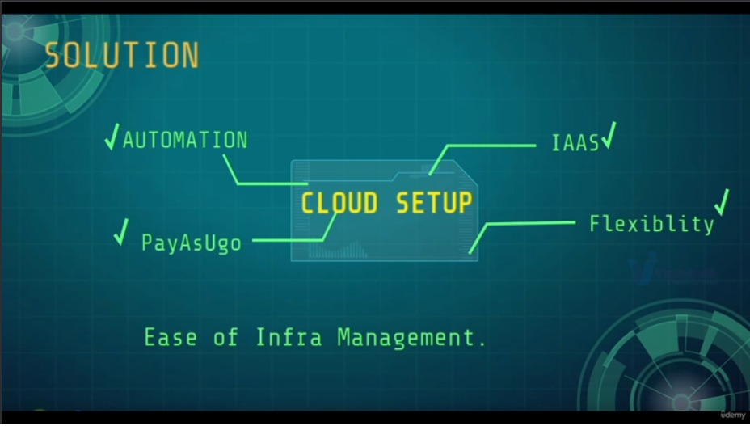
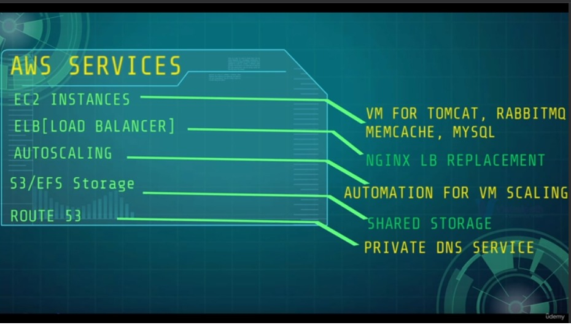
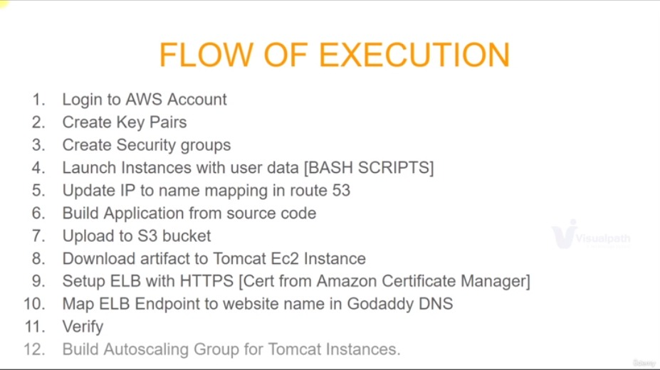
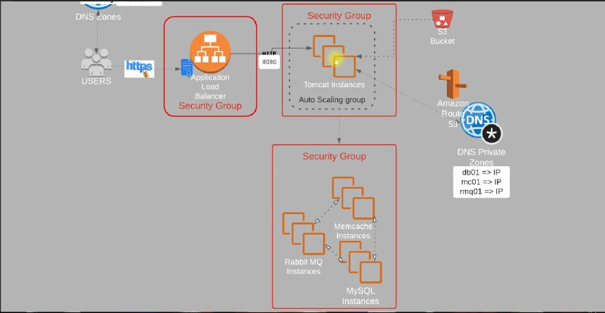

# **Cloud AWS pour la configuration du projet | Soulever et déplacer**

 

|PLAN|
|-----|
|Présentation|
|Groupe de sécurité et paires de clés|
|Instances EC2|
|Construire et déployer des artefacts|
|Équilibreur de charge et DNS|
|Groupe de mise à l'échelle automatique|
|Valider et résumer|

### PRESENTATION

#### **1) À propos du projet**
+ Pile d'applications Web multiniveau [VPROFILE]
+ Hébergez et exécutez sur le cloud AWS pour la production
+ Stratégie Lift & Shift

#### **2) SCÉNARIO**
+ Services d'application fonctionnant sur des machines physiques/virtuelles.
+ Charge de travail dans votre Datacenter.
+ Équipe de virtualisation, équipe DC OPS, équipe de surveillance, administrateur système, etc. impliqués.

#### **3) PROBLÈME**
+ Gestion complexe
+ Augmenter/réduire la complexité
+ CapEx initiaux et OpEx réguliers
+ Processus manuel
+ Difficile à automatiser
+ Prend du temps

#### **4) SOLUTION**

+ Au lieu d'exécuter notre charge de travail dans notre centre de données, nous l'exécutons sur une plateforme Cloud Computing qui nous permet de ne pas payer le coût initial d'acquisition de la ressource. Nous payons au fur et à mesure.
+ Nous consommons l'infrastructure en tant que service.
+ Nous bénéficions d'une flexibilité, d'une élasticité par nature, d'une possibilité d'extension ou d'augmentation et d'une réelle maîtrise des coûts.
+ La gestion de l'infrastructure devient donc facile.
+ Nous pouvons automatiser chaque étape et chaque processus pour éviter les erreurs humaines et gagner du temps.

#### **5) AWS Services**

+ Les instances EC2 seront les VM pour : 
    + Serveur Tomcat
    + Serveur RabbitMQ
    + Serveur Memcache
    + Serveur MySQL
+ Equilibreur de charge qui rmeplacera notre service Nginx.
+ AutoScaling : pour mettre automatiquement à l'échelle nos instances EC2, afin de contrôler nos ressources et nos coûts.
+ Stockage : S3 ou EFS, ainsi que ROUTE 53 pour le service DNS privé. 

#### **6) OBJECTIF**
+ INFRA flexibles
+ AUCUN FRAIS INITIAL
+ Moderniser efficacement
+ IAAS

#### **7) Architecture des services AWS pour le projet**
+ Instances EC2
+ ELB
+ Mise à l'échelle automatique
+ EFS/S3 pour le stockage partagé
+ Gestion des certificats Amazon
+ Route 53

 

#### **8) Groupe de Sécurité**

#### **9) Description des services**

**Amazon Route 53**
+ Un moyen fiable de diriger les utilisateurs vers des applications Internet
+ Amazon Route 53 est un service Web de système de noms de domaine (DNS) dans le cloud hautement disponible et évolutif.